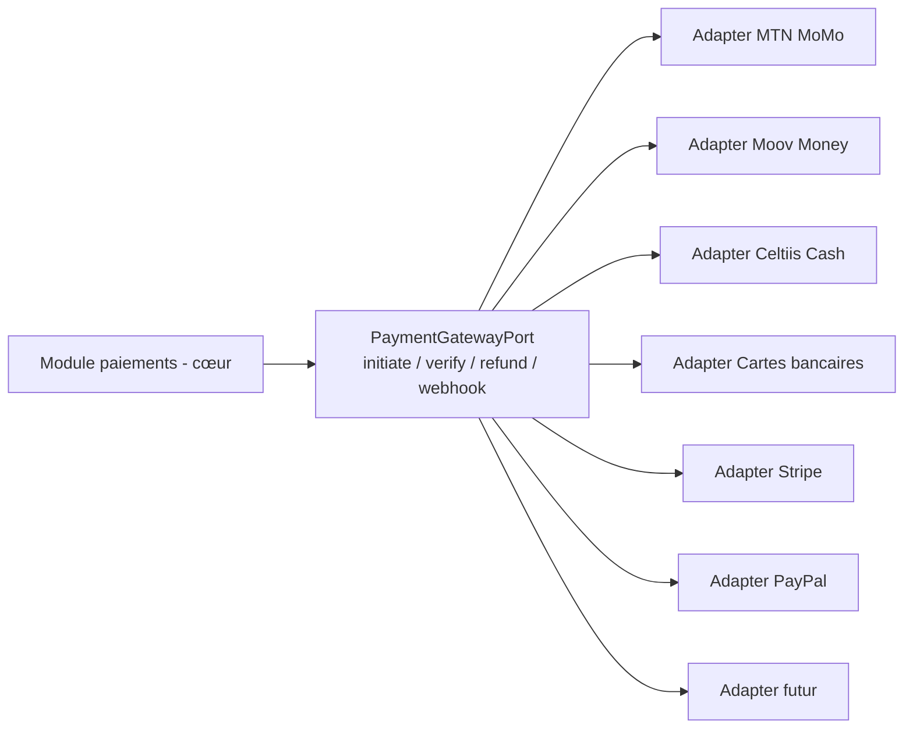
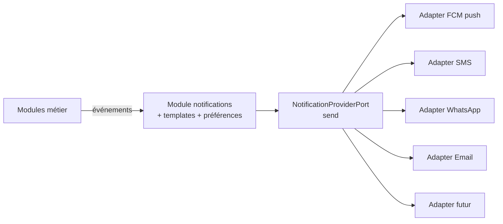

# Revue d'Architecture — Réponse aux 15 points de validation

Version : 1.1 — Étape 1 (revue)
Statut : intégré dans l'architecture → voir ADR complétés et nouveaux diagrammes

---

## Synthèse des verdicts

| # | Point | Verdict initial | Action |
|---|---|---|---|
| 1 | Multi-pays | Partiellement couvert | ✅ Renforcé : module géographique hiérarchique complet |
| 2 | Multi-langues | Non couvert | ✅ Nouveau : stratégie i18n |
| 3 | Paiements | Non couvert | ✅ Nouveau : architecture Payment Provider |
| 4 | Notifications | Non couvert | ✅ Nouveau : architecture Notification Provider |
| 5 | Stockage | Couvert (ADR-007) | ✅ Confirmé + port explicite |
| 6 | Cartographie | Couvert (ADR-006) | ✅ Confirmé + port explicite |
| 7 | IA | Non couvert | ✅ Nouveau : module IA vide avec ports définis |
| 8 | Recherche | Couvert (ADR-003) | ✅ Confirmé + mécanisme de synchronisation |
| 9 | Cache | Partiel (Redis) | ✅ Renforcé : cache multi-niveaux |
| 10 | Monitoring | Non couvert | ✅ Nouveau : OpenTelemetry prêt |
| 11 | API versionnée | Couvert (ADR-010) | ✅ Confirmé |
| 12 | Sécurité | Couvert (ADR-008) | ✅ Renforcé : audit, anti-bot, anti-fraude |
| 13 | Marketplace | Partiel (Mode B) | ✅ Renforcé : cycle complet devis → négociation → réservation → paiement → avis |
| 14 | Open/Closed | Couvert par principe | ✅ Confirmé + règle de revue de code |
| 15 | Diagrammes C4 | Non fourni | ✅ Nouveau : C4 complet + logique + physique + flux |

---

## 1. Multi-pays (renforcé)

**Principe** : le pays fait partie de TOUTE requête et de TOUT enregistrement structurant. Aucun code métier ne contient de référence au Bénin.

**Hiérarchie géographique unifiée** (modèle "un pays = une pyramide", extensible sans code) :

```
Country (BJ, TG, BF, NE, CI, SN…)
 └── Region
      └── Department
           └── Commune
                └── Arrondissement
                     └── Quartier
```

- Un seul module `geography` avec des tables en arborescence récursive (références `parent_id`).
- Le Bénin utilise son découpage (départements → communes → arrondissements → quartiers) ; le Togo aura le sien (régions → préfectures…) **sans changement de schéma**.
- Tout enregistrement structurant porte `country_code` (ISO 3166-1 alpha-2).
- Devise par pays : XOF pour l'UEMOA, configurable.
- Recherche toujours bornée au pays courant (dérivé du token ou de l'en-tête `X-Country`).
- La traduction des entités géographiques (nom en français, anglais, langues locales) est prévue par le modèle i18n du point 2.

**Règle d'architecture** : interdiction de tout `WHERE` ou constantes de localisation en dur dans le code métier.

---

## 2. Multi-langues (nouveau)

**Stratégie i18n dès le premier jour :**

| Niveau | Mécanisme |
|---|---|
| Chaînes UI (apps) | Fichiers de traduction Flutter (`.arb`) : français, anglais + emplacements langues locales |
| Messages backend | Module de traductions (templates de notifications, e-mails, SMS) |
| Contenu métier (catégories, noms de villes…) | Colonnes JSONB de traductions ou table `i18n` par entité |
| API | En-tête `Accept-Language` ; les réponses renvoient les libellés dans la langue demandée |
| Choix langue | Par défaut : langue du pays ; modifiable par utilisateur |

**Règle d'architecture** : aucune chaîne utilisateur visible n'est écrite en dur dans le code (frontend comme backend).

---

## 3. Paiements — Payment Provider (nouveau)

Le cœur de l'application ne connaît **jamais** un fournisseur : il parle au port `PaymentGatewayPort`.



- Ajouter un fournisseur = ajouter un adapter + une configuration, **zéro modification** du domaine.
- Toutes les transactions passent par une table `transactions` unique (statuts, références fournisseur).
- **Webhooks normalisés** : chaque provider est converti en un événement métier unique (`payment.succeeded`, `payment.failed`…) via le pattern Outbox.
- Mode **test/sandbox** pour chaque fournisseur, activable par configuration.
- Déclencheurs : devis accepté, commande restaurant, abonnement premium.

---

## 4. Notifications — Notification Provider (nouveau)

Même principe : le domaine publie un **événement métier** (`request.new_quote`, `order.ready`…), le module notifications le transforme en envoi via des adapters.



- Les messages sont des **templates i18n** (point 2), pas du texte codé en dur.
- Chaque utilisateur configure ses canaux (push, SMS, email, WhatsApp) et sa langue.
- Ajouter un canal (WhatsApp Business, Telegram…) = un adapter + configuration.

---

## 5. Stockage — Storage Provider (confirmé)

Port `StoragePort` : `upload / presignedUrl / delete / getUrl`.

- Implémentation par protocole S3 → compatible Cloudflare R2, MinIO, AWS S3, Google Cloud Storage (via interopérabilité S3 ou adapter dédié).
- **Aucun code métier ne touche un SDK de stockage** directement.

---

## 6. Cartographie — Map Provider (confirmé)

Port `MapPort` : `geocode / reverseGeocode / distance / route / tiles`.

- Adapter OSM (actuel), Google Maps, Mapbox (futurs) — ajout par configuration.
- Le domaine travaille avec des coordonnées (lat/lon) pures ; il ne dépend jamais d'une lib de carte.

---

## 7. IA — module vide avec ports (nouveau)

Module `ai` créé dès le MVP, **sans implémentation**, avec ses ports définis (contrats stables) :

| Port | Signature (exemple) | Usage futur |
|---|---|---|
| `RecommendationPort` | `recommend(clientId, context) → ids` | Suggestions accueil |
| `PricingPort` | `estimatePrice(category, params) → range` | Suggestion de prix aux pros |
| `ReviewsAnalysisPort` | `analyze(reviewId) → sentiments` | Modération assistée |
| `MatchingPort` | `match(requestId) → rankedPros` | Mode B amélioré |
| `FraudDetectionPort` | `assess(activity) → riskScore` | Anti-fraude (paiements, comptes) |
| `AssistantPort` | `chat(userId, message) → answer` | Assistants conversationnels |

Le MVP fournit des **implémentations de repli** simples (heuristiques) pour ne jamais bloquer le produit ; les modèles IA viendront s'y brancher en Phase 3 sans toucher aux consommateurs.

---

## 8. Recherche (confirmé + synchronisation)

Port `SearchPort` : `search(query) → results`, `index(entity)`, `remove(id)`.

- MVP : implémentation PostgreSQL + PostGIS (ADR-003).
- Futur : Elasticsearch / Meilisearch / OpenSearch — **un adapter** derrière le même port.
- **Synchronisation prête dès le MVP** : à chaque écriture métier, un événement est émis (Outbox) pour (re)indexer la donnée. Ainsi, le passage à un moteur dédié ne demande aucun changement dans les modules métier.

---

## 9. Cache multi-niveaux (renforcé)

Stratégie en 4 niveaux, du plus rapide au plus lent :

```
N1 CDN (Cloudflare)          → statiques, médias, tuiles, pages publiques
N2 Cache local (in-process)  → données ultra-chaudes (catégories, config pays)
N3 Redis                     → cache-aside des requêtes, sessions, OTP, files
N4 PostgreSQL                → source de vérité
```

- Pattern **cache-aside** avec invalidation par événements (pas de TTL aveugle sur les données métier).
- TTL définis par type de donnée (catégories : longue ; résultats de recherche : court ; profil : moyen).
- Les interfaces du domaine cachent le niveau de cache : un changement de politique ne touche pas le métier.

---

## 10. Monitoring (nouveau)

Interfaces et infrastructure de **traçabilité prévues dès le MVP** (branchement réel en Phase 1/2) :

- **Logs** : journalisation structurée (JSON) avec `correlation-id` sur chaque requête.
- **Métriques** : compteurs/timers sur les endpoints, files, jobs (interface OpenTelemetry Metrics).
- **Traces** : propagation OpenTelemetry prête (tous les adapters l'appellent via interface).
- **Alertes** : hooks de seuils (taux d'erreur, latence, file bloquée).
- **Tableaux de bord** : Grafana prévu (Prometheus + Loki/Grafana, ou Sentry pour les erreurs).
- **Sécurité** : tous les événements sensibles sont journalisés (audit, point 12).

Aucun module métier ne fait de `console.log` : tout passe par le port `LoggingPort`.

---

## 11. API versionnée (confirmé)

- Toutes les routes sous `/api/v1/…`.
- Versioning par en-tête `Accept` pour les évolutions mineures ; nouvelle majeure = `v2` en parallèle le temps de la migration.
- Contrat documenté (Swagger) publié à chaque version (voir Étape 4).

---

## 12. Sécurité (renforcé)

| Brique | Déjà prévu | Renfort |
|---|---|---|
| Rate limiting | ✅ par IP et compte | + par endpoint métier, fenêtres adaptatives (Redis) |
| RBAC | ✅ rôles + permissions | + granularité fine (ex. `pro.update_own_profile`) |
| Audit logs | Partiel | ✅ table `audit_logs` : qui, quoi, quand, IP, avant/après — actions sensibles uniquement |
| Anti-bot | ❌ | ✅ heuristiques (fréquence, empreinte appareil) + CAPTCHA si suspicion ; interface vers `ai.fraud` |
| Anti-fraude | ❌ | ✅ événements de risque émis vers le port FraudDetection (P3) ; règles simples dès le MVP (inscription OTP, vérification CIN, cooldowns) |
| Sensible data | ✅ chiffrement | + masquage téléphone dans les logs |
| Protection comptes | ✅ OTP | + verrouillage après échecs répétés, notification de connexion nouvelle |

---

## 13. Marketplace — cycle complet (renforcé)

Le module `requests` couvre désormais le cycle de bout en bout (le Mode A recherche directe est un raccourci vers la même réservation) :

```
Publication besoin → Réponses (devis) → Négociation (chat + contre-offre)
        → Réservation (créneau) → Paiement (port payements)
        → Prestation → Avis (multi-critères) → Transaction (commission)
```

Nouvelles entités prévues : `quotes` (avec statut et contre-offres), `negotiations`, `bookings` (réservations/rendez-vous liés au paiement), `transactions` (avec commission plateforme).

Le cycle est **modélisé par statuts explicites** (OPEN → QUOTED → NEGOTIATING → SELECTED → PAID → COMPLETED → REVIEWED | CANCELLED) avec règles de transition validées par le domaine.

---

## 14. Évolutivité — Open/Closed (confirmé)

- Principe **Open/Closed** appliqué via : ports d'interface (providers), événements de domaine, stratégies par configuration.
- **Règle de revue de code** : toute nouvelle dépendance externe doit passer par un port ; interdiction d'importer un SDK tiers dans `domain` ou `application`.
- Les modules communiquent par événements (Outbox) : ajouter une fonctionnalité = ajouter un consommateur, jamais modifier un producteur.
- Tests de contrat sur les ports : un adapter peut être remplacé si les tests passent (Consumer-Driven Contracts, Phase 1).

---

## 15. Diagrammes (fournis dans 03b-diagrammes-c4.md)

- ✅ Diagramme C4 : niveau Context, niveau Container, niveau Component (exemple module requests)
- ✅ Diagramme d'architecture logique
- ✅ Diagramme d'architecture physique (déploiement)
- ✅ Diagrammes des flux principaux (auth, recherche, besoin/devis, paiement, notification)

---

## Conséquences sur les documents existants

1. **01-architecture-globale.md** : la section "Communication inter-modules" et la liste des modules sont complétées (ajout : `geography`, `payments`, `ai`, `i18n` transversal, `monitoring` transversal). Les ports suivants font partie du socle : `PaymentGatewayPort`, `NotificationProviderPort`, `StoragePort`, `MapPort`, `SearchPort`, `SmsPort`, `LoggingPort`.
2. **02-adr.md** : 8 nouveaux ADR ajoutés (voir fichier mis à jour).
3. **04-arborescence-projet.md** : ajout des modules `geography`, `payments`, `ai` et du dossier transversal `shared/ports`.

**→ Étape 1 validée selon la revue. Prêt pour l'Étape 2 (conception PostgreSQL).**
