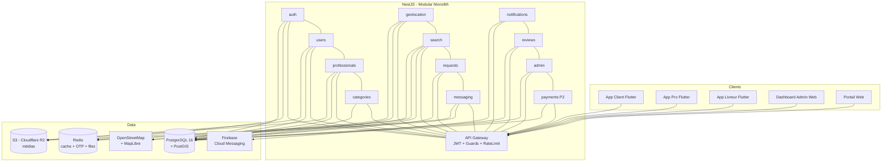
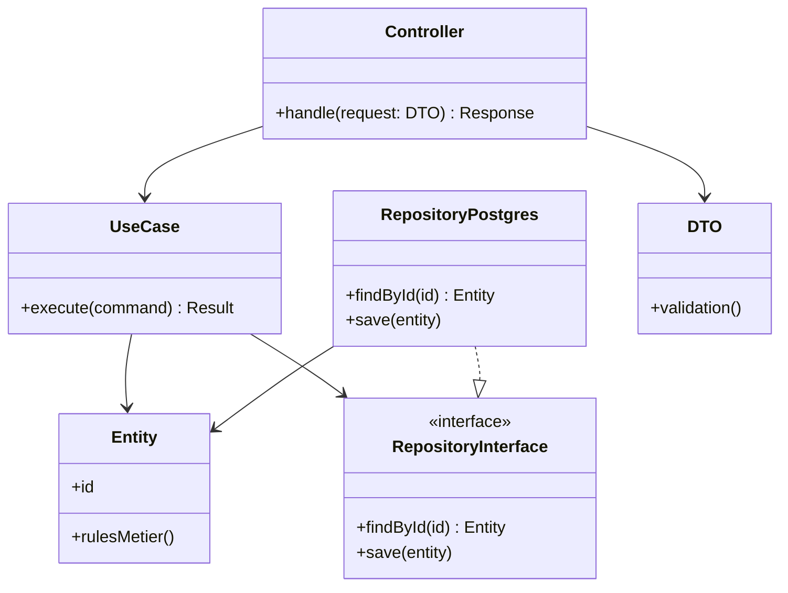
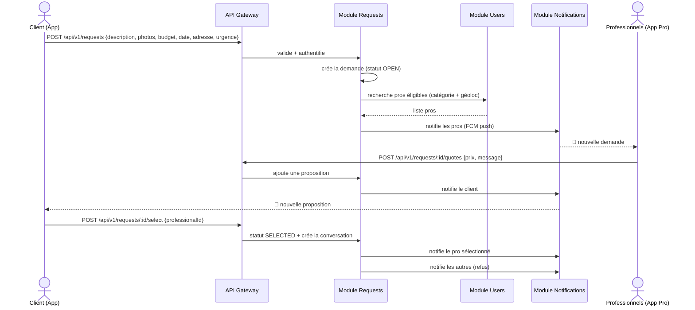
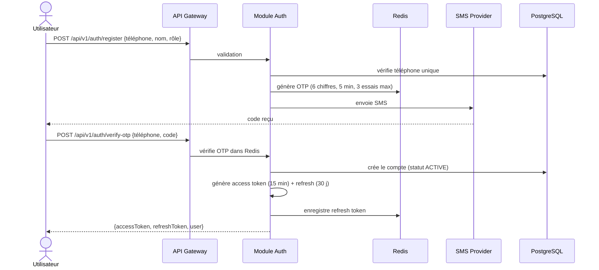
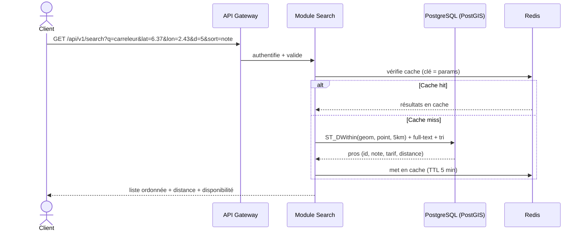
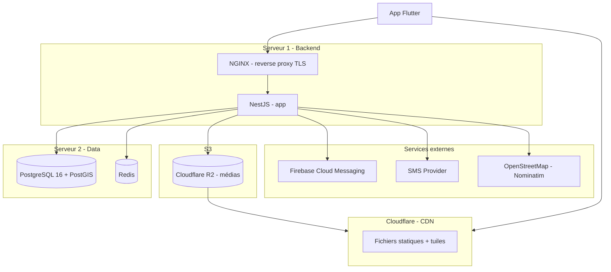
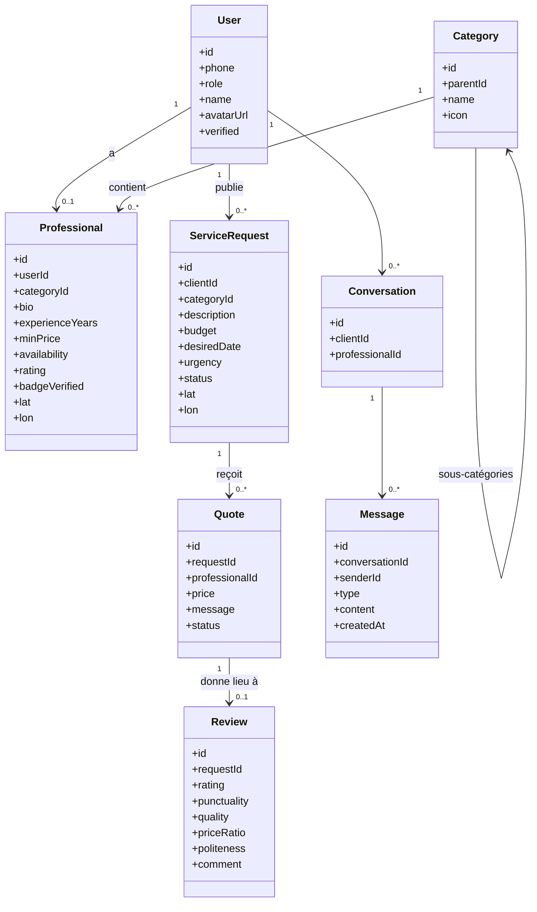

# Diagrammes UML (Mermaid)

Les diagrammes sont écrits en Mermaid : ils s'affichent directement sur GitHub,
GitLab ou VS Code (extension Mermaid).

---

## 1. Diagramme de composants (vue système)

---

## 2. Diagramme de classes — structure d'un module (Clean Architecture)

Règle : la flèche va toujours de l'extérieur vers l'intérieur (le domaine est au centre).

---

## 3. Diagramme de séquence — Mode B (publication d'un besoin)

---

## 4. Diagramme de séquence — Flux d'authentification (OTP)

---

## 5. Diagramme de séquence — Recherche avec géolocalisation

---

## 6. Diagramme de déploiement (MVP)

---

## 7. Diagramme de classes — Domaines clés (aperçu, détaillé à l'Étape 2)

