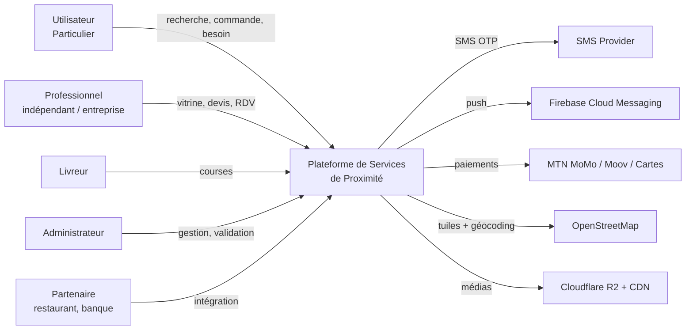
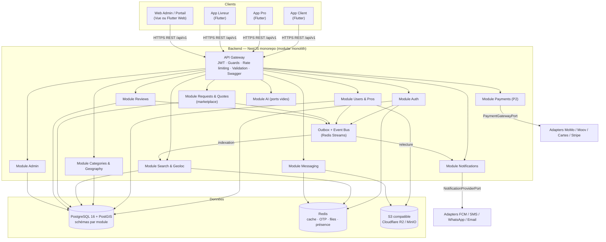
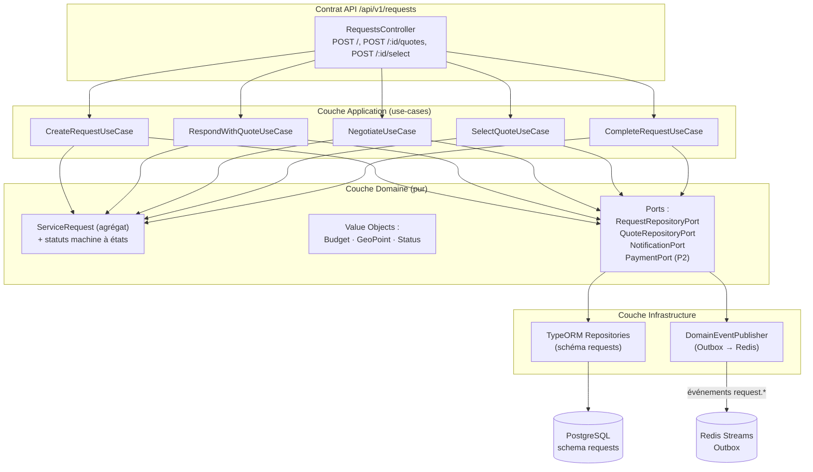
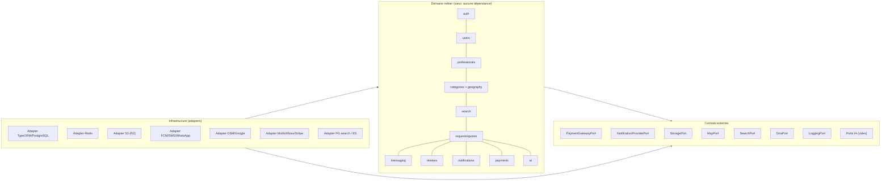
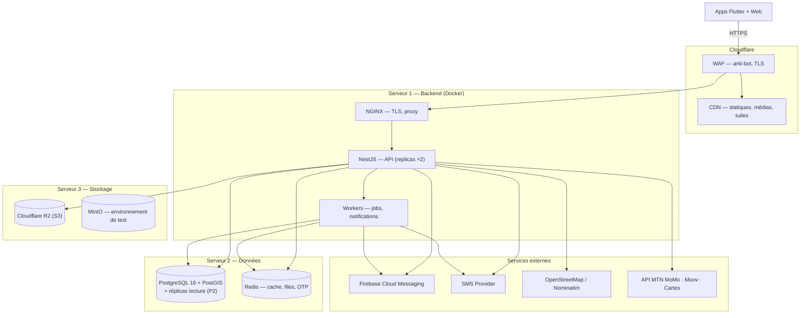
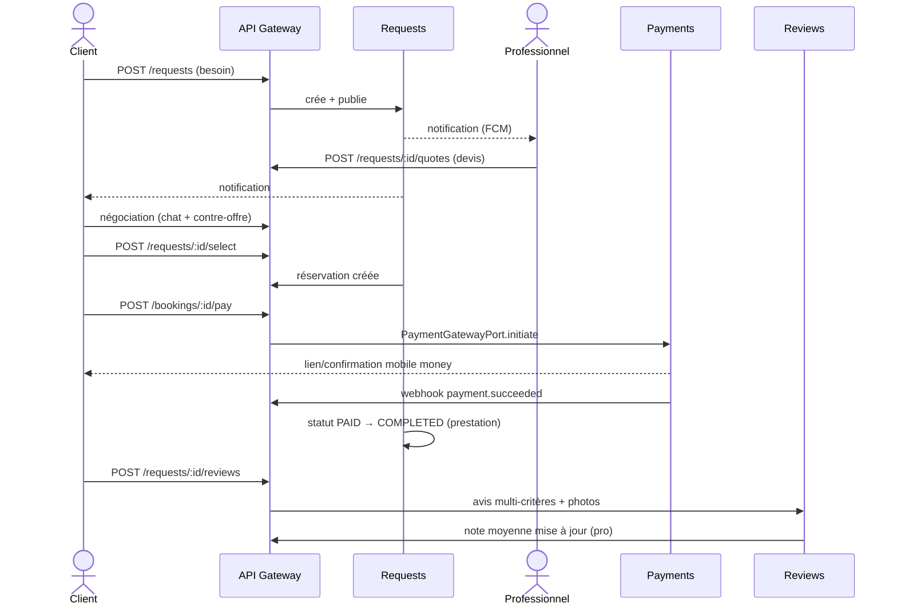
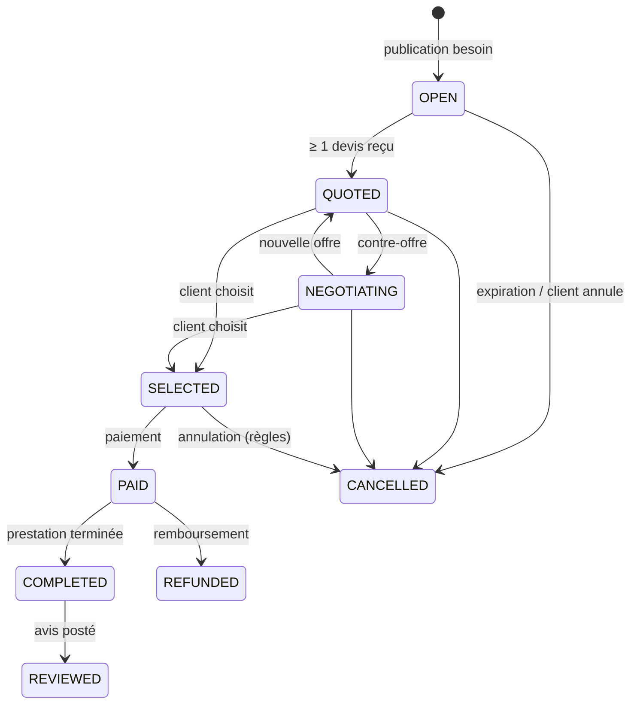
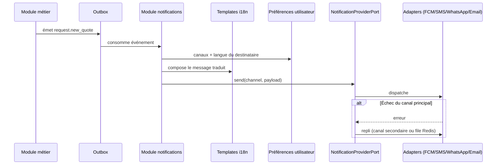
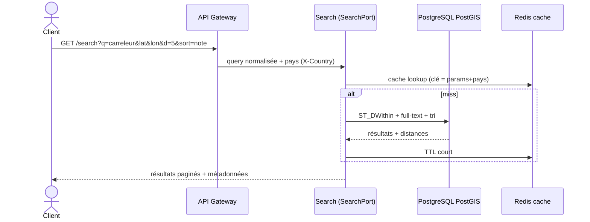

# Diagrammes C4 — Plateforme de Services de Proximité

Version : 1.1 — ajout demandé par la revue d'architecture (point 15)

Niveaux fournis : Context, Container, Component (exemple). S'y ajoutent :
architecture logique, architecture physique, flux principaux.

---

## Niveau 1 — C4 Context (le système et son environnement)

---

## Niveau 2 — C4 Container (technologies et frontières)

---

## Niveau 3 — C4 Component (exemple : module Requests)

---

## Architecture logique (couches, ports, dépendances)

Lecture : le domaine **déclare** les ports ; l'infrastructure **les implémente**.
La flèche de dépendance va toujours vers le domaine, jamais l'inverse.

---

## Architecture physique (déploiement)

---

## Flux principaux

### Flux 1 — Parcours client complet (marketplace)

### Flux 2 — Cycle de vie d'une demande (machine à états)

### Flux 3 — Notifications multi-canaux

### Flux 4 — Géolocalisation et recherche

