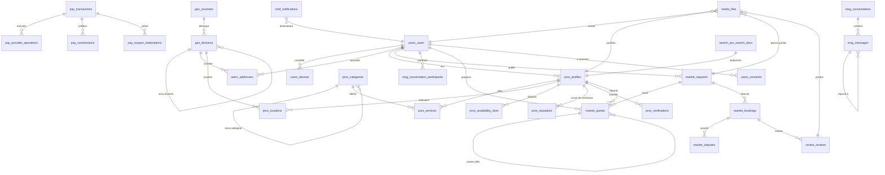
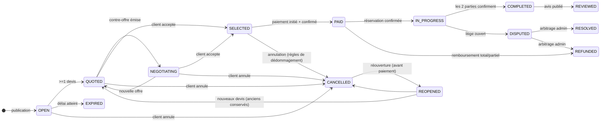

# Étape 2 — Conception PostgreSQL : Fondations et Conventions

Version : 1.0
Livrables complémentaires : `06a-tables-mvp-core.md`, `06b-tables-mvp-market.md`, `06c-tables-phase2-3.md`

---

## 1. Posture de conception

- **Vision long terme** : la base doit supporter plusieurs millions d'utilisateurs et plusieurs pays sans refonte.
- **Anti-surconception** : chaque table répond à un besoin métier réel ou à une évolution raisonnablement prévisible (documenté dans chaque fiche table).
- **Conformité aux ADR** : ports de paiement/notification/stockage/cartographie → les tables externes sont des tables de liaison, jamais des tables métier (ex. `pay.provider_operations` isole chaque fournisseur).

---

## 2. Conventions de nommage

| Élément | Convention | Exemple |
|---|---|---|
| Schémas | 1 schéma = 1 domaine, nom court | `auth`, `users`, `geo`, `pros`, `market`, `pay`, `review`, `msg`, `notif`, `admin`, `audit`, `ai`, `food`, `delivery`, `billing` |
| Tables | pluriel, `snake_case` | `service_requests`, `quote_responses` |
| Colonnes | `snake_case` | `response_time_min` |
| Clé primaire | toujours `id` (UUID) | `id uuid` |
| Clé étrangère | `<table singulière>_id` | `professional_id` |
| Colonnes d'état | `status` + enum (voir §4) | `status varchar(32)` |
| Indices | `idx_<table>_<colonnes>` | `idx_requests_status_created` |
| Clés uniques | `uq_<table>_<colonnes>` | `uq_reviews_booking` |
| Contraintes | `ck_<table>_<règle>` | `ck_transactions_amount_pos` |
| Foreign keys | `fk_<table>_<table cible>` | `fk_quotes_request` |

---

## 3. Colonnes standard communes

Toutes les tables portent (sauf mention contraire justifiée) :

| Colonne | Type | Règle |
|---|---|---|
| `id` | `uuid` | PK, `default gen_random_uuid()` |
| `created_at` | `timestamptz` | `not null default now()` — toujours en UTC |
| `updated_at` | `timestamptz` | `not null default now()` — maintenu par trigger `set_updated_at()` |
| `deleted_at` | `timestamptz` | `null` = actif (soft delete) — voir §5 |
| `version` | `int` | `not null default 1` — verrouillage optimiste (tables agrégats uniquement) |
| `country_code` | `char(2)` | `not null` + FK `geo.countries` — présent sur TOUT enregistrement structurant (ADR-009, ADR-013) |

**Justification UUID :** choix de l'UUID sur BIGSERIAL car :
1. les IDs ne doivent pas être devinables/énumérables (concurrence, sécurité, données clients) ;
2. la future découpe en microservices exige des clés générées localement sans centralisation ;
3. l'UUID **v7 (ordonné dans le temps)** est recommandé à terme pour la localité d'index ; au MVP `gen_random_uuid()` (v4) est acceptable car les clés d'interrogation chaude sont les index de recherche, pas les PK ;
4. le BIGSERIAL reste disponible si une table de pure logistique le justifie.

---

## 4. Types PostgreSQL utilisés

| Type | Usage | Justification |
|---|---|---|
| `uuid` | clés primaires | §3 |
| `timestamptz` | toutes les dates | UTC, TZ-sûr, comparables |
| `numeric(14,2)` | tous les montants | jamais de `float` (argent) ; 2 décimales (cartes) même si XOF affiche 0 |
| `char(3)` | devises | ISO 4217 (`XOF`, `EUR`…) |
| `char(2)` | pays | ISO 3166-1 alpha-2 |
| `varchar(32)` | statuts, types (énum) | + `CHECK` — plus simple à migrer qu'un type ENUM PostgreSQL natif |
| `varchar(20)` | téléphones | sans format imposé en base |
| `jsonb` | données flexibles | payloads, traductions, options, événements — indexable GIN |
| `geography(Point,4326)` | positions GPS | calculs de distance exacts (sphère terrestre) via PostGIS |
| `geography(MultiPolygon,4326)` | zones de couverture | zones d'intervention, zones de livraison |
| `geometry(Polygon,4326)` | périmètres administratifs | rendu cartographique (léger) |
| `tsvector` | recherche plein texte | colonne générée + index GIN |
| `ltree` | chemins hiérarchiques (géographie) | navigation arborescente rapide pays→quartier |
| `vector` | embeddings IA | extension `pgvector` (phase 3, colonnes préparées) |

---

## 5. Extensions PostgreSQL requises

| Extension | Rôle |
|---|---|
| `postgis` | géolocalisation (types, index GiST, `ST_DWithin`, `ST_DistanceSphere`) |
| `pg_trgm` | recherche floue sur les noms (`%carreleur%` → trigrammes) |
| `pgcrypto` | `gen_random_uuid()` |
| `unaccent` | recherche insensible aux accents (français/locales) |
| `ltree` | hiérarchie géographique (optionnel au MVP) |
| `pgvector` | embeddings IA (créée dès le départ, tables `ai.*` préparées) |
| `citext` | `email` (optionnel, sinon `lower(email)`) |

---

## 6. Soft delete, versionnement, triggers

- **Soft delete** : `deleted_at` NULL/renseigné. Jamais de suppression physique sauf purge légale/réglementaire (données personnelles — RGPD/loi béninoise).
- **Index partiels** : chaque `uq_` unique est **partiel** (`WHERE deleted_at IS NULL`) pour que le soft delete ne bloque pas la recréation (ex. un téléphone).
- **Versionnement** : colonne `version` sur les agrégats (requêtes, profils, transactions) pour l'optimistic locking ; `updated_at` journalisé en plus dans `audit.logs`.
- **Trigger standard** : `set_updated_at()` sur toutes les tables (BR UPDATE).

---

## 7. Organisation par domaines (schémas)

```
auth      → identité, OTP, tokens, tentatives
users     → profils, appareils, adresses, favoris, réglages
geo       → pays, découpage administratif, zones de couverture
pros      → profils pro, services, portfolio, horaires, vérification, zones d'intervention
market    → besoins, devis, négociation, réservations, litiges (MACHINE À ÉTATS)
pay       → transactions, opérations fournisseurs, coupons, promotions, abonnements, wallet, fidélité
review    → avis multi-critères, modération
msg       → conversations, messages
notif     → notifications, préférences, templates
admin     → tâches de validation, signalements, bannissements, annonces, stats
audit     → journal d'audit, événements (Outbox), connexions
ai        → recommandations, embeddings, estimations prix, fraud scores, chat
food      → restaurants, menus, articles (Phase 2)
delivery  → livreurs, commandes, courses (Phase 2)
billing   → facturation, commissions (Phase 2/3)
```

Chaque schéma est indépendant : un module peut être extrait en microservice avec **ses propres tables** sans impact (ADR-002).

---

## 8. Modèle conceptuel (MCD) — vue d'ensemble

```
USER (client / pro / livreur / admin) 1----n ADRESSE
USER 1----n APPAREIL
USER n----n ROLE            (multi-rôles : un pro peut être client)
USER n----n PROFESSIONNEL   (via PROFIL)
USER 1----n BESOIN          (market)
PROFESSIONNEL n----n CATEGORIE   (via SERVICE)
PROFESSIONNEL 1----n PORTFOLIO / HORAIRES / DISPONIBILITES / ZONE_D'INTERVENTION / VERIFICATION
BESOIN 1----n DEVIS
DEVIS n----n CLIENT         (négociation = chaîne de contre-offres)
BESOIN 1----1 RESERVATION   (1---1 Détail paiement)
RESERVATION 1---0..1 PAIEMENT
PAIEMENT 1----n OPERATION_FOURNISSEUR   (indépendance fournisseurs)
RESERVATION 1---0..1 AVIS
RESERVATION 1---0..n LITIGE
USER 1----n CONVERSATION / MESSAGE
USER 1----n NOTIFICATION
PROFESSIONNEL 1----n COMMISSION / ABONNEMENT / PROMOTION
COUPON n----n TRANSACTION  (redemptions)
```

---

## 9. Modèle logique (MLD) / Schéma relationnel — cœur



Le schéma relationnel **complet** (tables détaillées colonne par colonne) figure dans
`06a-tables-mvp-core.md`, `06b-tables-mvp-market.md` et `06c-tables-phase2-3.md`.
Les 7 ajustements de la revue de gel (historique, Trust Score, recherche, médias, RGPD, zones)
sont dans `06d-revue-schema.md`.
Le niveau ERD est fourni par domaine dans ces mêmes documents (un ERD global de
60+ tables serait illisible).

---

## 10. Machine à états — Marketplace (cœur du projet)

Transitions validées par le domaine (le SQL ne fait que stocker `status` ;
les règles vivent dans les use-cases) :



Règles associées (documentées, testables) :
- `OPEN` : expire automatiquement (job) après `expires_at` (48 h par défaut, réglable).
- `PAID` : le paiement doit réussir avant réservation confirmée.
- `COMPLETED` : exige la confirmation client ET pro (protection bilatérale).
- `DISPUTED` : seuls les litiges ouverts sur une réservation PAYÉE sont possibles.
- Une fois `REVIEWED`, plus aucune transition (immutabilité avis).
- `REOPENED` : possible uniquement si jamais payé (annulation avant paiement) ; les devis et la négociation sont conservés et restent visibles.
- Chaque transition est enregistrée dans `audit.aggregate_events` (historique reconstructible — voir `06d-revue-schema.md` §1).

---

## 11. Stratégie de performance

### 11.1 Types d'index

| Type | Usage | Exemples |
|---|---|---|
| **B-tree** | FK, unicité, tri, bornes de temps | `(country_code, status, created_at)`, `(professional_id, created_at desc)` |
| **GIN** | full-text (`tsvector`), `jsonb`, trigrammes `pg_trgm` | `idx_profiles_search` (GIN trgm sur noms), `idx_notifications_payload` |
| **GiST** | géométries PostGIS (recherche par rayon) | `location` sur pros, demandes, livreurs |
| **GIN trgm** | recherche floue (`ILIKE '%…%'`) | noms de pros, restaurants, communes |
| **Partiels** | unicité sous soft delete | `uq_users_phone WHERE deleted_at IS NULL` |
| **Composite** | requêtes réelles des use-cases (jamais d'index "au hasard") | `(status, expires_at)` pour le job d'expiration |

Règle : chaque index est **justifié par une requête du produit** (voir fiches tables) ;
aucun index orphelin. Les index sont créés **avec** la table dans la migration.

### 11.2 Recherche par proximité (PostGIS)

```sql
-- pros actifs dans un rayon de 5 km autour d'un point, triés par note
CREATE INDEX idx_pros_locations_gist ON pros.locations USING gist (location);

SELECT p.*, ST_DistanceSphere(l.location, ST_MakePoint(:lon, :lat)) AS dist
FROM pros.locations l
JOIN pros.profiles p ON p.id = l.professional_id
WHERE p.status = 'ACTIVE'
  AND ST_DWithin(l.location, ST_MakePoint(:lon, :lat)::geography, 5000)
ORDER BY dist, p.rating_avg DESC
LIMIT 50;
```

- `geography` → distances en mètres, exactes sur la sphère (pas besoin de projection locale).
- Combinaison rayon + tri par `rating_avg` : un index partiel `(status) WHERE status='ACTIVE'` + GiST.

### 11.3 Partitionnement futur (préparé, non activé au MVP)

Tables candidates (RANGE mensuel sur `created_at`) :
- `msg.messages` (très gros volume d'écriture)
- `audit.logs`, `audit.events` (log immuable)
- `pay.transactions` (rétention longue)

Activation : au-delà de ~50 M lignes par table ou dès que les écritures dégradent.
Toutes les tables candidates utilisent des clés secondaires **sans dépendre de l'index PK global** (les PK uniques doivent inclure la clé de partition au moment du passage — documenté dans chaque fiche).

### 11.4 Archivage

- `audit.*` : rétention 2 ans en base active, puis export S3 (parquet) via job mensuel.
- `msg.messages` : conversations fermées > 12 mois → archivage partitionné.
- `notif.notifications` : purge à 6 mois (l'historique utilisateur reste côté app).
- Les soft-deleted records sont purgés après 3 ans (sauf obligations légales).

### 11.5 Optimisation des recherches (bonnes pratiques imposées)

- Pagination par **keyset** (`WHERE (created_at, id) < (?, ?) ORDER BY … LIMIT`) — jamais d'OFFSET sur les grosses tables.
- Toutes les requêtes bornées par `country_code` (multi-pays) → index composites commençant par `country_code` dès que pertinent.
- `EXPLAIN (ANALYZE)` exigé en revue de code pour toute nouvelle requête sur table > 1 M lignes.
- Les agrégats affichés (rating_avg, rating_count, completed_jobs) sont **maintenus par transaction** (jamais de `AVG()` au fil de l'eau sur les listes).
- Hot data en Redis (ADR-018) : catégories, pros populaires, configs pays ; cache-aside.

---

## 12. Conventions de migration

- 1 migration = 1 module ; nommage `NNNN_<module>_<description>.sql`.
- Chaque migration est **idempotente de contrôle** (vérifie l'existence avant d'appliquer).
- Les migrations sont reviewées comme du code (l'ordre d'application est linéaire).
- Rollback : chaque migration fournit un down (sauf DDL irréversible documenté).

---

## 13. Récapitulatif des documents

| Fichier | Contenu |
|---|---|
| `06-schema-base.md` (ce fichier) | Conventions, types, extensions, MCD, MLD, machine à états, performance |
| `06a-tables-mvp-core.md` | Tables détaillées : auth, users, geo, pros, ai (préparée) |
| `06b-tables-mvp-market.md` | Tables détaillées : market, pay, review, msg, notif, admin, audit |
| `06c-tables-phase2-3.md` | Tables détaillées (niveau moyen) : food, delivery, billing/abonnements/coupons/wallet/fidélité |

---

## 14. Validation attendue

- [ ] Conventions (naming, UUID, soft delete, colonnes standard) approuvées
- [ ] Types + extensions approuvés
- [ ] Machine à états marketplace validée
- [ ] Stratégie d'index/partitionnement/archivage validée
- [ ] Fiches tables des documents 06a/06b/06c approuvées
