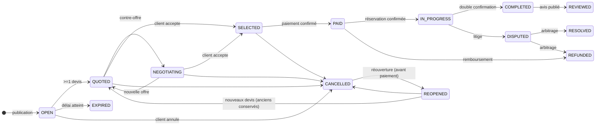

# Révision du schéma — Réponse aux 7 ajustements (gel du schéma)

Version : 1.1 du schéma
Ces ajustements sont **intégrés** dans les documents 06-schema-base, 06a, 06b, 06c.
Ce document explique les décisions et liste les changements précis.

---

## Ajustement 1 — Historique complet (Event Sourcing léger)

### Problème
Le parcours d'une demande (publié → 5 devis → 3 contre-offres → accepté → annulé → réouvert) doit être **reconstituable intégralement**, sans passer à un Event Sourcing complet.

### Solution : journal d'événements d'agrégat (append-only)

Nouvelle table `audit.aggregate_events` (distincte de l'Outbox) :

| Colonne | Type | Notes |
|---|---|---|
| id | uuid PK | |
| aggregate_type | varchar(64) NOT NULL | `ServiceRequest`, `Quote`, `Booking`, `Transaction`… |
| aggregate_id | uuid NOT NULL | |
| version | bigint NOT NULL | numéro de version de l'agrégat |
| event_type | varchar(64) NOT NULL | `request.published`, `quote.added`, `request.cancelled`, `request.reopened`… |
| payload | jsonb NOT NULL | données de l'événement (state complet ou delta) |
| actor_id | uuid NULL FK users.users | qui a déclenché |
| created_at | timestamptz NOT NULL | |

**Contraintes** : `uq_aggregate_events UNIQUE(aggregate_type, aggregate_id, version)` — immuable, aucune insertion hors séquence.
**Index** : `idx_aggregate_events(aggregate_type, aggregate_id, version)`.

### Règles
- **Écriture transactionnelle** : chaque use-case écrit l'état dans la table métier **et** l'événement dans `aggregate_events` (même transaction).
- **Reconstruction** : rejouer les événements d'un agrégat = état complet à tout instant (outil de debug, reconstitution après incident).
- **Différence avec l'Outbox** (`audit.events`) : l'Outbox propage aux autres modules et est purgeable ; `aggregate_events` est l'historique permanent de l'agrégat (conservé 10 ans puis archivé S3).
- **Coût** : un agrégat de demande génère < 20 événements sur sa vie — volume négligeable, bénéfice d'audit total.

### Impact sur la machine à états
Nouvel état `REOPENED` et transition `CANCELLED → REOPENED` (réouverture possible **uniquement avant paiement**, avec conservation des devis existants) :

---

## Ajustement 2 — Système de réputation (Trust Score)

### Problème
La note seule ne suffit pas : il faut un score composite exploitable (trust).

### Solution : table `pros.reputation` (1:1 avec le profil) + score dénormalisé

| Colonne | Type | Notes |
|---|---|---|
| professional_id | uuid PK FK pros.profiles | |
| completed_jobs | int NOT NULL DEFAULT 0 | nombre de missions |
| acceptance_rate | numeric(5,2) NULL | devis acceptés / envoyés |
| cancellation_rate | numeric(5,2) NULL | annulations après sélection |
| avg_response_min | int NULL | délai moyen de réponse (devis) |
| punctuality_avg | numeric(2,1) NULL | issu des avis (ponctualité) |
| avg_execution_days | numeric(5,1) NULL | temps moyen d'exécution |
| disputes_count | int NOT NULL DEFAULT 0 | litiges (pondérés) |
| seniority_days | int NOT NULL DEFAULT 0 | ancienneté |
| verification_level | smallint NOT NULL DEFAULT 0 | 0..3 (aucune → CIN → docs → badge) |
| ai_factor | numeric(5,2) NULL | futur : poids IA/recommandations (Phase 3) |
| trust_score | numeric(3,2) NOT NULL DEFAULT 0 | score composite 0..5 |
| trust_level | varchar(16) NOT NULL DEFAULT 'NEW' | `NEW`, `LOW`, `MEDIUM`, `HIGH`, `EXCELLENT` |
| recomputed_at | timestamptz NOT NULL | |
| created_at / updated_at | | |

### Règles
- **Calcul** : job nocturne + recomputation immédiate après événements structurants (avis, litige, annulation). La formule (pondérations) vit en configuration, **pas en code** (évoluera avec la Phase 3 IA).
- **Dénormalisation** : `trust_score` copié sur `pros.profiles` pour le tri de recherche (cf. ajustement 3) et sur la projection de recherche.
- **Traçabilité** : chaque recomputation est journalisée dans `audit.aggregate_events` (event `reputation.recomputed` avec payload = scores).
- Chaque métrique brute est dérivée des tables existantes (quotes, bookings, reviews, disputes) — aucune donnée en double : la table est un **cache calculé**.

---

## Ajustement 3 — Recherche ultra-rapide (index dédié)

### Problème
La requête "plombier disponible aujourd'hui à moins de 5 km noté > 4,5" doit répondre en millisecondes, même à plusieurs millions de lignes.

### Solution : projection de recherche `search.pro_search_docs`

Une **projection dédiée** (denormalisée), alimentée par l'Outbox (ADR-016 / indexation) — exactement le pattern "search index" indépendant du schéma métier :

| Colonne | Type | Notes |
|---|---|---|
| professional_id | uuid PK FK pros.profiles | |
| country_code | char(2) NOT NULL | |
| status | varchar(32) NOT NULL | ACTIVE… |
| category_ids | uuid[] NOT NULL | catégories + ancêtres (filtre arborescent) |
| name_search | tsvector NOT NULL | nom + métier + services (GIN) |
| name_trgm | varchar(160) NOT NULL | trigrammes (GIN) — fautes tolérées |
| rating_avg | numeric(2,1) NOT NULL | |
| trust_score | numeric(3,2) NOT NULL | ajustement 2 |
| min_price | numeric(14,2) NULL | |
| location | geography(Point,4326) NOT NULL | GiST |
| division_id | uuid NULL | filtre quartier/commune |
| available_today | boolean NOT NULL DEFAULT false | calculé sur slots+overrides+bookings |
| available_now | boolean NOT NULL DEFAULT false | |
| available_until | timestamptz NULL | prochain créneau |
| updated_at | timestamptz NOT NULL | |
| version | bigint NOT NULL | |

**Index** : GIN `name_search`, GIN `name_trgm`, GiST `location`, composite `(country_code, status, available_today, rating_avg desc)`.

### Règles
- La requête cible = 1 index scan combiné : filtre `(status='ACTIVE', available_today)` → GiST rayon → tri `rating_avg`/`trust_score` → `LIMIT`. Réponse < 50 ms à plusieurs millions de lignes.
- **Mise à jour par événements** : quote ajouté → `available_*` recalculé ; avis → `rating_avg` ; chaque événement de l'Outbox met à jour la ligne concernée (ou file Redis→batch).
- **Au MVP** : la projection est remplie par les mêmes consommateurs que le cache Redis ; **plus tard** : le `SearchPort` (ADR-003) bascule vers Elasticsearch/Meilisearch **avec exactement le même document** — zéro changement de schéma métier.
- Aucune table métier n'est modifiée pour la recherche → réponse directe à "sans refaire le schéma".

---

## Ajustement 4 — Disponibilités (anti double-réservation)

### Existant (confirmé)
`pros.availability_slots` (récurrents), `pros.availability_overrides` (congés), `market.bookings` (réservations).

### Renfort : verrouillage des créneaux
- **Unicité d'usage** : un créneau est réservable une seule fois. Validation en use-case **transactionnelle** :
  1. `SELECT … FOR UPDATE` sur la ligne pro (ou advisory lock `pg_advisory_xact_lock(professional_id)`) ;
  2. vérification d'absence de chevauchement : `SELECT 1 FROM market.bookings WHERE professional_id = $1 AND status IN ('CONFIRMED','IN_PROGRESS') AND tsrange(scheduled_start, COALESCE(scheduled_end, scheduled_start)) && tsrange($2, $3) FOR UPDATE` ;
  3. insertion de la réservation + événement `booking.scheduled`.
- Index existant `idx_bookings_pro_date(professional_id, scheduled_start)` — la vérification d'overlap est O(index).
- **Temps réel** : pendant la saisie client, les créneaux indisponibles sont servis depuis Redis (précalcul des plages libres par pro, TTL court).
- La double réservation devient une exception impossible (verrou transactionnel), jamais un état tolérable.

---

## Ajustement 5 — Table média générique

### Problème
`pros.portfolio_items`, `market.request_attachments`, `review.review_photos` dupliquent la même structure.

### Solution : schéma `media` — UNE table pour tous

**Nouveau schéma `media`**, table `media.files` :

| Colonne | Type | Notes |
|---|---|---|
| id | uuid PK | |
| owner_type | varchar(32) NOT NULL | `PROFESSIONAL`, `REQUEST`, `REVIEW`, `CERTIFICATION`, `VERIFICATION`, `MESSAGE`, `INVOICE`, `USER` |
| owner_id | uuid NOT NULL | id de l'entité |
| purpose | varchar(32) NOT NULL | `AVATAR`, `PORTFOLIO`, `BEFORE_AFTER`, `ATTACHMENT`, `REVIEW_PHOTO`, `DOCUMENT`, `INVOICE`, `VOICE_NOTE` |
| media_type | varchar(16) NOT NULL | `IMAGE`, `VIDEO`, `DOCUMENT`, `AUDIO` |
| mime_type | varchar(64) NOT NULL | |
| size_bytes | bigint NOT NULL DEFAULT 0 | |
| width / height | int NULL | images |
| duration_sec | int NULL | vidéos/audio |
| url | text NOT NULL | URL CDN finale |
| s3_key | varchar(512) NOT NULL | clé d'origine (ADR-007) |
| sort_order | int NOT NULL DEFAULT 0 | |
| status | varchar(16) NOT NULL | `PROCESSING`, `READY`, `FAILED` (thumbnails/vignettes) |
| created_at / updated_at / deleted_at | | |

**Index** : `idx_media_owner(owner_type, owner_id, sort_order)` ; `idx_media_s3(s3_key)`.
**Clé S3** : `{country}/{owner_type}/{owner_id}/{uuid}.{ext}` — organisée et traçable.

### Tables supprimées (remplacées par des lignes `media.files`)
| Ancienne table | Devenir |
|---|---|
| `pros.portfolio_items` | `media.files` owner_type=`PROFESSIONAL`, purpose=`PORTFOLIO`/`BEFORE_AFTER` |
| `market.request_attachments` | `media.files` owner_type=`REQUEST`, purpose=`ATTACHMENT` |
| `review.review_photos` | `media.files` owner_type=`REVIEW`, purpose=`REVIEW_PHOTO` |

### Tables conservées (métadonnées métier propres), avec référence `media_id`
- `pros.certifications` : garde `name`, `issuer`, `verified` → remplace `file_url` par `media_id uuid FK media.files`.
- `pros.verifications` : garde `type`, `status`, `reviewed_by` → `media_id uuid FK media.files`.
- `msg.messages` : garde `media_url` (lecture rapide chat) → `media_id uuid NULL` optionnel.
- Les `users.users.avatar_url`, `food.restaurants.logo_url` : restent des colonnes courtes, mais peuvent pointer vers `media.files` via `media_id` à l'usage.

Résultat : **ajouter un nouveau type de fichier (factures, voice notes) = 1 valeur d'enum, zéro table**.

---

## Ajustement 6 — RGPD / droit à l'oubli

### Mesures intégrées

| Exigence | Table / mécanisme |
|---|---|
| Suppression logique | `deleted_at` partout (déjà en place) + purge physique après 3 ans (job) |
| **Anonymisation** | `users.users.anonymized_at timestamptz NULL` — à l'anonymisation : téléphone/e-mail/nom remplacés par valeurs pseudonymisées (hash), identifiants conservés pour l'audit, données financières conservées (obligation comptable), profil pro gelé |
| **Export des données** | Endpoint API `GET /api/v1/me/export` (job asynchrone) produisant un JSON complet (profil, adresses, demandes, devis, messages, transactions, avis) — la structure suit les tables, aucun code spécial de relecture |
| Historique | `audit.aggregate_events` (ajustement 1) + `audit.logs` couvrent toutes les actions ; rien n'est perdu |
| **Consentements** | Nouvelle table `users.consents` : |

| Colonne | Type | Notes |
|---|---|---|
| id | uuid PK | |
| user_id | uuid NOT NULL FK users.users | |
| type | varchar(32) NOT NULL | `TOS`, `PRIVACY`, `MARKETING`, `LOCATION`, `DATA_PROCESSING` |
| version | varchar(16) NOT NULL | version du document consentie |
| granted | boolean NOT NULL | |
| granted_at | timestamptz NULL | |
| revoked_at | timestamptz NULL | |
| created_at | timestamptz NOT NULL | |

**Contraintes** : `uq_consents UNIQUE(user_id, type)` ; règle métier : aucun usage (notification marketing, géoloc) sans consentement `granted` valide.
**Justification** : table immuable par consentement révoqué conservé (historique des versions), prêt pour RGPD/loi béninoise et pays futurs (ADR-013).

---

## Ajustement 7 — Zones géographiques (polygones, cercles, rayons)

### Problème
"J'interviens dans toute la commune d'Abomey-Calavi" ≠ cercle autour d'un point.

### Solution : `geo.areas` (remplace `geo.zones`)

| Colonne | Type | Notes |
|---|---|---|
| id | uuid PK | |
| country_code | char(2) NOT NULL FK geo.countries | |
| name | varchar(120) NOT NULL | "Abomey-Calavi", "Zone aéroport" |
| division_id | uuid NULL FK geo.divisions | lié à une commune/quartier si pertinent |
| shape_type | varchar(16) NOT NULL | `CIRCLE`, `POLYGON`, `DIVISION` |
| center | geography(Point,4326) NULL | si CIRCLE |
| radius_m | numeric(10,2) NULL | si CIRCLE |
| polygon | geography(MultiPolygon,4326) NULL | si POLYGON (ou DIVISION = bordure de geo.divisions) |
| active | boolean NOT NULL DEFAULT true | |
| created_at | timestamptz NOT NULL | |

**Index** : GiST `idx_areas_polygon(polygon)` ; GiST `idx_areas_center(center)`.
**Contraintes** : `ck_areas_shape (shape_type='CIRCLE' → center ET radius_m NOT NULL ; 'POLYGON' → polygon NOT NULL ; 'DIVISION' → division_id NOT NULL)`.

### Utilisation
- **Pro** : nouvelle table `pros.coverage_areas (professional_id, area_id, created_at)` — PK `(professional_id, area_id)`. Remplace `pros.intervention_zones` (qui ne couvrait que les divisions) : "j'interviens dans le cercle de 10 km autour de Cotonou **et** toute la commune de Calavi".
- **Vérification d'éligibilité** : `ST_Intersects(pro.location + radius, area.polygon/center)` → un client hors zone est informé avant la commande.
- **Livraison (P2)** : `food.restaurants.delivery_area_id uuid NULL FK geo.areas` (zone polygonale de livraison) + `delivery` réutilise `ST_Intersects`.
- Les `geo.divisions` existantes restent (recherche par ville/quartier) ; `geo.areas` ajoute le **périmètre dessiné**.

---

## Récapitulatif des changements de tables

| Action | Table | Doc impacté |
|---|---|---|
| + | `audit.aggregate_events` (historique) | 06d, 06b |
| + | `pros.reputation` (Trust Score) | 06d, 06a |
| + | `search.pro_search_docs` (projection) | 06d, 06b |
| + | `media.files` (média générique) | 06d, 06b |
| + | `users.consents` (RGPD) | 06d, 06a |
| + | `pros.coverage_areas` | 06d, 06a |
| ✏️ | `geo.zones` → `geo.areas` (cercles/polygones) | 06d, 06a |
| ✏️ | `market.service_requests` : état `REOPENED` ajouté | 06d, 06-schema-base |
| ✏️ | `pros.profiles` : colonne `trust_score` dénormalisée | 06d, 06a |
| ✏️ | `users.users` : colonne `anonymized_at` | 06d, 06a |
| ✏️ | `pros.certifications` / `pros.verifications` : `media_id` | 06d, 06a |
| – | `pros.portfolio_items` (→ media.files) | 06d, 06a |
| – | `market.request_attachments` (→ media.files) | 06d, 06b |
| – | `review.review_photos` (→ media.files) | 06d, 06b |
| – | `pros.intervention_zones` (→ pros.coverage_areas) | 06d, 06a |
