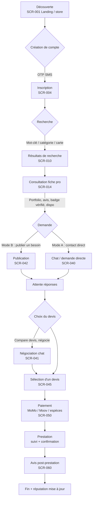
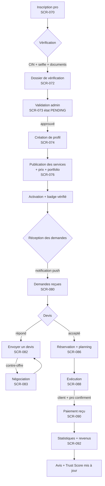
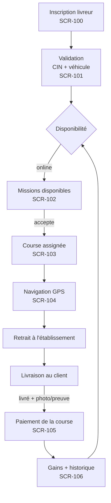
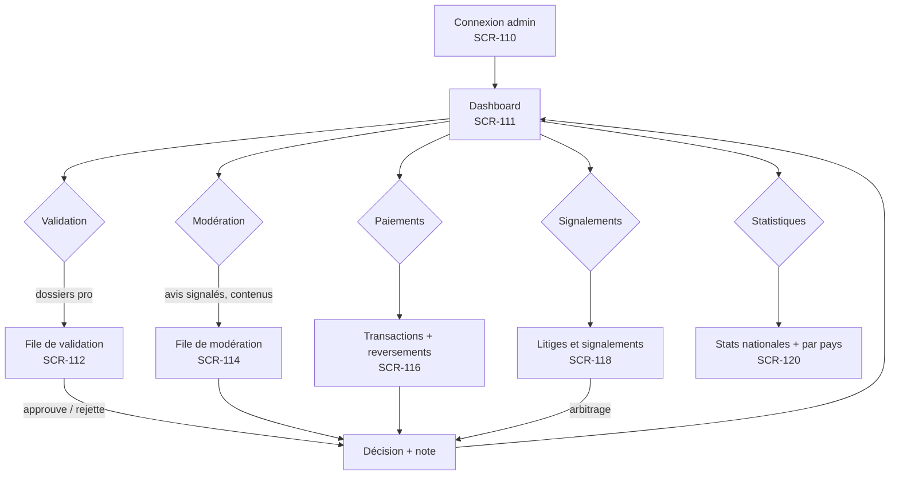

# 3.1 — Product Flows (TCHATCHA)

Parcours utilisateur complets, par persona. Chaque étape référence les écrans (SCR)
et User Stories (US) associés (références complètes dans `07b` et `07g`).

---

## 1. Client — parcours complet

Étapes clés et exigences :
- **Découverte sans compte** : recherche consultable sans connexion (basse friction) — la connexion n'est requise que pour contacter/publier.
- **Mode A** (recherche directe) et **Mode B** (publication) convergent vers la même réservation → paiement → avis (modèle marketplace, ADR-020).
- **Badge "Professionnel vérifié TCHATCHA"** affiché dès la fiche pro et dans les résultats — pilier de la promesse de confiance.

---

## 2. Professionnel — parcours complet

Étapes clés et exigences :
- **Vérification avant visibilité** : aucun pro non vérifié dans les résultats (confiance TCHATCHA).
- **Disponibilités** : horaires + congés + créneaux → aucun double booking (schéma §Ajustement 4).
- **Devis** : réponse rapide récompensée (délai moyen = métrique du Trust Score).
- **Statistiques** : missions, taux d'acceptation, annulations, revenus (PRD §19).

---

## 3. Livreur (Phase 2) — parcours complet

Étapes clés et exigences :
- Position temps réel (Redis → `delivery_runs`), assignation au plus proche (PRD §18).
- Preuve de livraison photo (litiges livraison).
- État online/offline = contrôle du livreur, jamais imposé.

---

## 4. Administrateur — parcours quotidien

Étapes clés et exigences :
- **Files unifiées** (validation, modération, litiges) — `admin.validation_tasks` + `admin.reports` + `market.disputes`.
- Chaque décision est tracée (audit) — rien n'est réversible sans trace.
- Multi-pays : sélecteur de pays en tête de dashboard (ADR-013).

---

## 5. Règles transverses (tous les personas)

| Règle | Détail |
|---|---|
| Basse friction | Consultation sans compte ; connexion seulement pour agir |
| États systématiques | Chaque action a : loading, vide, erreur, offline, succès, skeleton |
| Confirmation destructrice | Suppression/annulation/paiement = dialog de confirmation |
| Idempotence perçue | Boutons désactivés pendant l'envoi (pas de double envoi devis/paiement) |
| Offline | Lecture seule des données en cache + file d'attente des messages |
| Accessibilité | Cibles tactiles ≥ 48 px, contrastes AA, textes énoncés par lecteurs d'écran |
